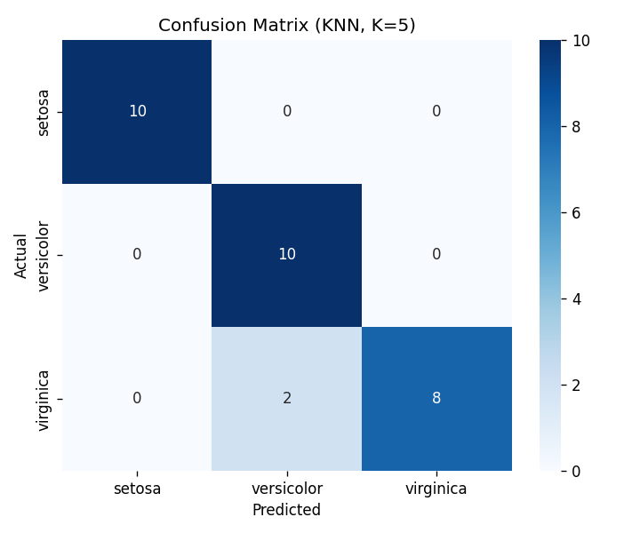
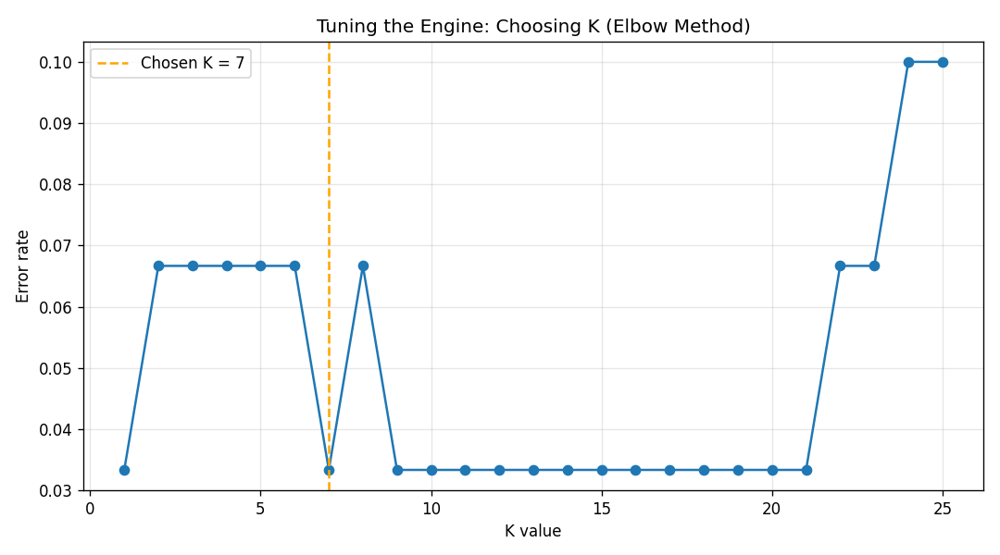

# DecodeLabs - AI Internship [projects]
# DecodeLabs — AI Industrial Training Kit (Batch 2026)

> Internship portfolio · Role: **Artificial Intelligence Engineer (Intern)** @ DecodeLabs
> A new project is unlocked each week. This repo collects all of them.


Each week moves one step up the AI ladder — from hand-written rules, to
machines that learn patterns from data, and beyond.

| Week | Project | Theme | Status |
|------|---------|-------|--------|
| **1** | Rule-Based AI Chatbot | Control flow & logic (white-box AI) | ✅ Done |
| **2** | Data Classification (KNN) | Supervised learning | ✅ Done |
| 3 | _to be assigned_ | — | 🔒 |
| 4 | _to be assigned_ | — | 🔒 |

```
.
├── week1-rule-based-chatbot/
│   ├── chatbot.py
│   └── rule_based_chatbot.ipynb
├── week2-data-classification/
│   ├── iris_classifier.py
│   ├── data_classification.ipynb
│   ├── requirements.txt
│   └── sample_outputs/        # example confusion matrix & elbow plot
└── README.md
```

---

#  Week 1 — Rule-Based AI Chatbot 
[Code-of-Week-1](https://www.kaggle.com/code/nabidnur/notebook11c38fbcd7)

A deterministic, **white-box** chatbot built purely from control flow and a
dictionary knowledge base. No machine learning, **no hallucination** — every
output is traceable: **Input → Logic → Output**.

### Spec checklist
| Requirement | Status | How |
|---|---|---|
| Continuous input loop | ✅ | `while True` loop |
| Sanitization (case + whitespace) | ✅ | `raw_input.lower().strip()` |
| Knowledge base, 5+ intents | ✅ | dictionary with **8 intents** |
| Fallback for unknowns | ✅ | default reply, no crash |
| Clean exit command | ✅ | `break` on `bye` / `exit` / … |

**Why a dictionary, not a long `if-elif` ladder?** A hash map gives **O(1)**
lookups that stay fast no matter how many rules exist, instead of the
**O(n)**, hard-to-maintain ladder.

### Run it
```bash
cd week1-rule-based-chatbot
python chatbot.py
```
On Kaggle, open `rule_based_chatbot.ipynb` and **Run All** — committed runs
have no keyboard, so the bot auto-falls-back to a scripted demo conversation.

```
You: HELLO
DecodeBot: Hey there! 👋 I'm DecodeBot...
You: asdfghjkl
DecodeBot: I do not understand that yet. 🤔 Type 'help'...
You: bye
DecodeBot: Goodbye! 👋
```

---

#  Week 2 — Data Classification Using AI 

The **predictive phase**. Instead of writing rules, we feed the machine
labelled history (the **Iris** dataset) and let it *derive* the decision
boundary itself. Algorithm: **K-Nearest Neighbors (KNN)**.

### The dataset — Iris benchmark
150 samples · 3 balanced classes (setosa, versicolor, virginica) · 4 features
(sepal & petal length/width). Built into scikit-learn, so **no download
needed**.

### Pipeline (IPO framework)
| Stage | Steps |
|---|---|
| **INPUT** | Load Iris → understand it → `StandardScaler` (mean 0, var 1) |
| **PROCESS** | 80/20 train-test split (shuffled, stratified) → KNN → tune K |
| **OUTPUT** | Confusion matrix → precision / recall / **F1 score** |

### Key engineering decisions
- **Split before scaling**, fit the scaler on the **training set only** — the
  test set stays an unseen "locked vault" with no data leakage.
- **`stratify=y`** keeps the 3 classes balanced in both splits.
- **Elbow method** tunes K: the full curve is plotted (so the K=1 overfitting
  end and large-K underfitting end are both visible), but the chosen K is the
  best **odd K ≥ 3** — odd avoids tie votes, and skipping 1–2 avoids
  overfitting.
- **We don't trust accuracy alone** — *"in imbalanced data, accuracy is a
  lie."* We report the confusion matrix and the F1 score (harmonic mean of
  precision and recall).

### Sample result
With a fixed seed (`random_state=42`): KNN with K=5 scores ~0.93 accuracy /
0.93 macro-F1, and the elbow-tuned K (~7) reaches ~0.97. See
`sample_outputs/` for the confusion matrix and elbow plot.



### Run it
```bash
cd week2-data-classification
pip install -r requirements.txt
python iris_classifier.py        # prints metrics, saves plots as PNG
```
On Kaggle, open `data_classification.ipynb` and **Run All** — every cell is
reproducible (no keyboard input needed).

---

##  Ideas to go further
- **Week 1:** more intents, multi-turn context, or wrap the bot as a
  rule-based *guardrail* in front of an LLM (hybrid architecture).
- **Week 2:** swap KNN for Logistic Regression / Decision Tree and compare;
  test the model on your own measurements; try cross-validation.

---

##  Author
**\<Nabidnur Abrar\>** — AI Intern @ DecodeLabs (Batch 2026)
*Built as the weekly milestones of the DecodeLabs AI Industrial Training Kit.*
